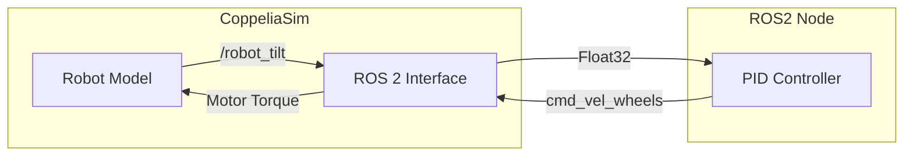
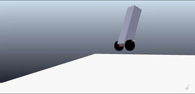

# 🤖 ROS 2 Self-Balancing Robot Simulation

A high-fidelity simulation of a two-wheeled self-balancing robot. This project demonstrates the integration between **ROS 2 (Humble/Foxy)** and **CoppeliaSim**, utilizing a **PID control loop** to maintain equilibrium.

---

## 🏗️ Architecture

The project is split into two main components:

1.  **Simulation (CoppeliaSim):** Physical model and sensor data (IMU) acquisition.
2.  **Controller (ROS 2):** A Python-based node that processes tilt data and calculates motor torques.



---

## 🚀 Getting Started

### 📋 Prerequisites

- **OS:** Ubuntu 22.04 (recommended) or 20.04
- **ROS 2:** Humble or Foxy
- **Simulator:** [CoppeliaSim Edu](https://www.coppeliarobotics.com/)

### 🔧 Installation

1.  **Setup Workflow:**

    ```bash
    mkdir -p ~/ros2_ws/src
    cd ~/ros2_ws/src
    git clone https://github.com/manumezog/self-balancing-robot-ros2.git
    cd ~/ros2_ws
    colcon build --symlink-install
    source install/setup.bash
    ```

2.  **Initialize Simulation:**
    - Launch **CoppeliaSim**.
    - Open the scene: `File > Open Scene` and select `scenes/balancing_robot.ttt`.

---

## 🕹️ Usage

### 1. Start the Physics Simulation

1. Launch **CoppeliaSim**.
2. Press the **Play** button in the top toolbar to start the simulation.

### 2. Run the Controller

1. Open a new terminal.

2. Source the workspace (Critical step!):

   ```bash
   cd ~/ros2_ws
   source install/setup.bash
   ```

3. Launch the brain:

   ```bash
   ros2 run self_balancing_brain pid_brain
   ```

The robot should now maintain its balance using the PID controller!

---

## 🧠 Control Logic

The robot uses a sophisticated PID controller implemented in `pid_controller.py`.

### 🎛️ PID Parameters

| Parameter | Value | Description                                                        |
| :-------- | :---- | :----------------------------------------------------------------- |
| **Kp**    | 180.0 | High proportional gain to quickly correct tilt errors.             |
| **Ki**    | 20.0  | Integral gain to eliminate steady-state error.                     |
| **Kd**    | 75.0  | High derivative gain to dampen oscillations and prevent overshoot. |

### 🛠️ Key Features

- **Anti-Windup:** The integral term is only accumulated when the robot is near its vertical target (within ±11°).
- **Safety Kill-Switch:** If the tilt angle exceeds 45°, the motors are automatically disabled to prevent damage.
- **Target Trim:** A slight target angle offset (`0.06` rad) is used to compensate for physical asymmetries.

---

## 🎥 Demo



---

## 🤝 Contributing

Contributions are welcome! Feel free to open issues or submit pull requests to improve the tuning or add new features like LQR control.

**Developer:** [@manumezog](https://github.com/manumezog)
